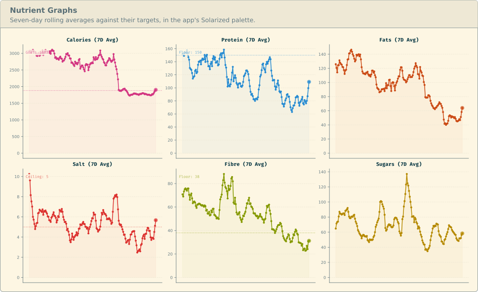

# Overview

Two disclaimers: first, this entire project's code, `docs` and `specs` folders, are essentially generated by an LLM, and hence likely belong to the public domain, and second, this is a very personal project with extremely specific use cases. Nonetheless, a subset of it may still be of use to someone.

Traker is a PyQt6 app for tracking health-related metrics. This includes diet, exercise, activity levels, caffeine intake, PC usage, and so on. There are several optional features that are strictly not recommended.



## Tracking Features
* **Calories:** Define arbitrary meals with their exact components and log them.
* **Caffeine:** Monitor daily caffeine intake and estimate leftover caffeine at sleep time.
* **Exercise:** Track exercise progress.
* **Real-Time Feedback:** Once something is logged, it immediately shows its effects.
* **Named Sets:** Bundle items that are often taken together.
* **Supplements:** Log supplements and measure daily intake.
* **Mobility & Cardio:** Log cardio sessions and see excess caloric burn over rest.
* **Training Plans:** Self-explanatory.
* **Graphs:** Nutrients, exercise, caffeine, supplements and an activity heatmap.
* **Focus Timer:** A focus/break split with idle time accounted for.
* **Keyboard-Centric:** Vim-style modes, a one-line command bar with fuzzy completion.
* **Multiple Members:** One shared catalog with separate logs.

### Strictly Not Recommended
All four are off by default. The first three need KDE Plasma 6 and Grayscale evenings needs 6.6.

* **Strict breaks:** A break spawns walls for every screen, costs a 10-second key hold to exit.
* **Grayscale evenings:** Traker modifies KWin's own filter to apply grayscale to every screen after a set hour.
* **Window pinning:** Forces Traker onto a named virtual desktop, activity and monitor via KWin rules.
* **Chores, DSI and the focus timeline:** A shared chore board and one daily number estimating finger strain.

## Requirements
The server needs Python, uv and somewhere to put a SQLite file. The client needs a desktop:

| | |
| --- | --- |
| Python 3.13 and [uv](https://docs.astral.sh/uv/) | both halves |
| A Wayland or X11 session | the client asks for `wayland`, then `xcb`; on X11 Qt also wants `libxcb-cursor0` |
| A D-Bus session bus | notifications, and asking how long you have been idle |
| KDE Plasma 6 | only the three KWin features above |
| `libmpv` | only for a film during a break, the `video` extra |

Any desktop should run the client. Without a session bus, the Focus Timer still runs, it just cannot
pause itself when you walk away.

## Installation
There are two sections. You must install both the client and the server app. However, the default assumption is that these will run on the same machine.

Python 3.13 and [uv](https://docs.astral.sh/uv/). Both run from the clone.

```bash
git clone https://github.com/kristian-tichota/Traker && cd Traker
uv sync --no-dev                  # logging only
uv sync --no-dev --extra graphs   # ...and the graph tabs
```

Start the server once to be given a token. It writes a commented
`~/.config/traker/server.toml`, then stops because there are no members:

```bash
uv run python server/app.py
```

Name yourself in it and start it again:

```toml
[[members]]
username = "alice"
```

A member with no `token` gets one minted, logged at WARNING and written back beside the name.
Note that the rewrite drops the file's comments.

Now the client, which writes its own `~/.config/traker/user_profile.toml`:

```bash
uv run python src/main.py
```

Paste the token under `[server] token` and restart. Without it every request is refused.

The server must be up before the client starts. Both default to `http://127.0.0.1:6035`, so on
one machine the token is all there is to connect. For a client elsewhere, set `host = "0.0.0.0"`
server-side and `[server] url` client-side. Do this only on a network you trust.

## Configuration
Note that there are two configuration files, one for the client and one for the server.

| File | Holds |
| --- | --- |
| `~/.config/traker/server.toml` | Address, port, database path, and one block per member. |
| `~/.config/traker/user_profile.toml` | Your body, goals, nutrient targets, keybinds, schedule, tabs, and every optional feature. |

Each is generated fully commented on that half's first start. `TRAKER_SERVER_HOST`,
`TRAKER_SERVER_PORT` and `TRAKER_DB_PATH` override the server's settings. `TRAKER_SERVER_URL`
and `TRAKER_API_TOKEN` override the client's. The profile is re-read whenever it changes, so
most edits need no restart.

Two defaults worth leaving alone:

```toml
[timer]
strict = false      # true is the full-screen walls on every monitor

[chores]
on_break = false    # true puts the chore board in front of you during a break
```

### Tabs
`[windows]` decides which tabs exist. A generated profile enables the everyday essential logging and the
graphs that read it. The rest is set as false.

```toml
[windows]
food = true
beverages = true            # drinks, and today's caffeine as it will be at bedtime
exercise = true
mobility = true             # mobility and cardio
food_graphs = true          # Nutrient Graphs
exercise_graphs = true
caffeine_graph = true       # 30 days of that bedtime figure
pomodoro = false            # the Focus Timer
supplements = false
supplement_graphs = false
heatmap = false             # a calendar of training and mobility energy
plans = false               # training cycles
chores = false              # the household chore board
```

Note that a graph tab needs the `graphs` extra as well, without which it is
skipped and the rest of the app runs.

## Licence
[AGPL-3.0-or-later](LICENSE). The icons under `assets/icons/` are Tabler's, MIT, and carry
their own `LICENSE` beside them.
